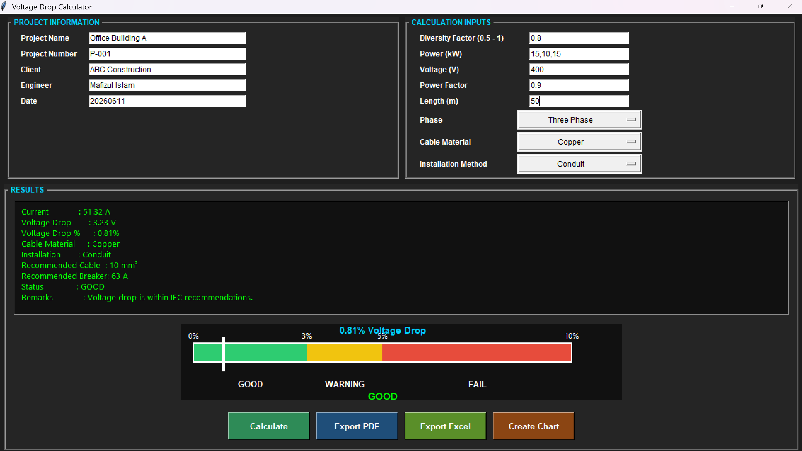
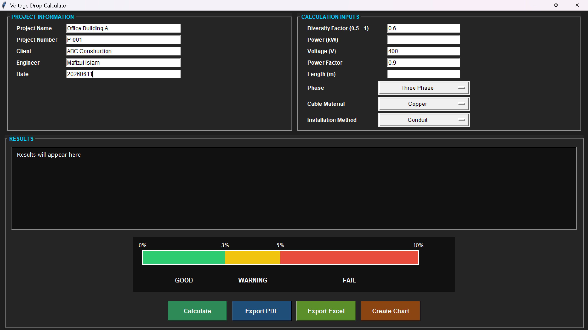
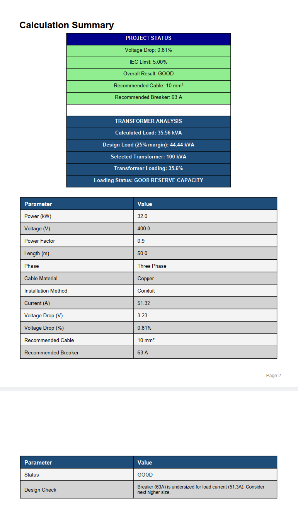
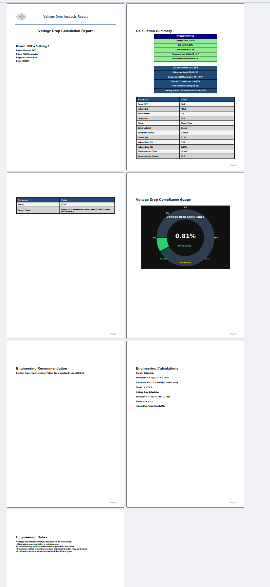
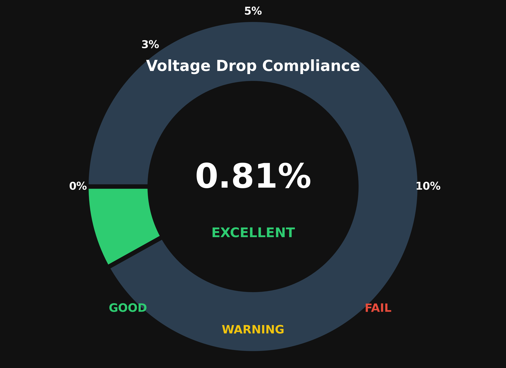
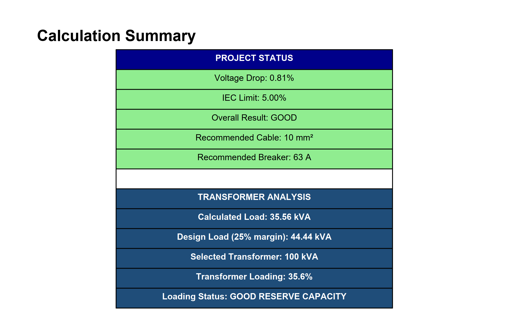

<<<<<<< HEAD
# electrical-distribution-design-tool
Python-based electrical distribution design tool for load analysis, voltage drop calculation, cable sizing, breaker selection, and transformer sizing with automated PDF reporting.
=======
# ⚡ Electrical Distribution Design Tool



A Python-based electrical engineering application designed for low-voltage (LV) distribution system design, load analysis, voltage drop calculation, cable sizing, breaker selection, transformer sizing, and automated engineering report generation.

This project demonstrates how electrical engineering principles can be combined with software automation to improve design efficiency and reduce manual calculation errors.

---

## 📌 Overview

Electrical distribution design requires repeated engineering calculations and careful verification of system parameters.

This tool automates key design steps including:

* Load aggregation and diversity factor application
* Current calculation for single and three-phase systems
* Voltage drop analysis
* Cable sizing recommendation
* Circuit breaker selection
* Transformer sizing and loading evaluation
* Professional PDF report generation

---

## 📸 Screenshots

### 🖥️ Main Interface

The user-friendly GUI allows engineers to input project data and electrical parameters.



---

### ⚙️ Calculation Results

Displays full engineering analysis including load, current, voltage drop, and equipment sizing.



---

### 📄 Engineering PDF Report

Automatically generated professional report for documentation and submission.



---

### 📉 Voltage Drop Analysis

Graphical representation of voltage drop performance against IEC limits.



---

### 🏭 Transformer Analysis

Shows transformer sizing, loading percentage, and reserve capacity evaluation.



---

## ⚙️ Key Features

### 🔌 Load Analysis

* Multiple load input support
* Connected load calculation
* Diversity factor application

### ⚡ Electrical Calculations

* Single and three-phase current calculation
* Voltage drop analysis
* IEC compliance evaluation

### 🧰 Equipment Sizing

* Cable size recommendation
* Breaker selection
* Transformer sizing with safety margin

### 🏭 Power System Analysis

* Transformer loading percentage
* Design adequacy evaluation
* Engineering recommendations

### 📄 Reporting

* Automated PDF report generation
* Structured engineering documentation
* Project summary and design verification

---

## 🧮 Engineering Formulas Used

### Current Calculation

Single Phase:
I = P / (V × PF)

Three Phase:
I = P / (√3 × V × PF)

---

### Voltage Drop

VD = √3 × I × R × L

---

### Apparent Power

kVA = kW / PF

---

### Transformer Design

Design kVA = kVA × Safety Factor (1.25)

---

## 🏗️ Typical Applications

* Commercial buildings
* Residential distribution systems
* Industrial electrical design
* LV feeder planning
* Preliminary system design studies

---

## 🛠️ Technology Stack

* Python 3
* Tkinter (GUI)
* ReportLab (PDF generation)
* Matplotlib (visualization)
* Electrical engineering calculation modules

---

## 📁 Project Structure

```text id="project_structure"
electrical-distribution-design-tool/
│
├── gui.py
├── calculations.py
├── report_generator.py
├── chart_generator.py
│
├── screenshots/
    ├── main_gui_load.png
│   ├── main_gui.png
│   ├── calculation_results.png
│   ├── pdf_report.png
│   ├── voltage_drop_gauge.png
│   └── transformer_analysis.png
│
└── README.md
```

---

## 🚀 How to Run

```bash id="run_cmd"
pip install reportlab matplotlib
python gui.py
```

---

## 🎯 Skills Demonstrated

### Electrical Engineering

* Power system analysis
* Electrical distribution design
* Cable sizing and voltage drop
* Transformer and breaker selection

### Software Engineering

* Python application development
* GUI design (Tkinter)
* Report automation
* Engineering tool development

---

## 🔮 Future Improvements (Project 4 Direction)

* Multi-feeder network simulation
* Fault current analysis
* Protection coordination studies
* CAD/DXF export for AutoCAD
* GIS-based network visualization
* Smart load forecasting

---

## 👨‍💻 Author

Electrical Engineer
Focus: Power Systems, Grid Design, Engineering Automation

---

## 📌 Project Vision

To build practical engineering software tools that bridge electrical design, automation, and modern digital engineering workflows used in utility and consulting industries.
>>>>>>> 61e06bb (Initial release: Electrical Distribution Design Tool)
